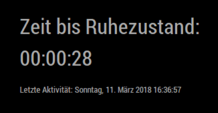

# MMM-PIR
MMM-PIR is a module for the [MagicMirror](https://github.com/MichMich/MagicMirror) project by [Michael Teeuw](https://github.com/MichMich).

It uses a PIR sensor attached to your raspberry pi's GPIO pins to check for users. After a configurated time without any user interaction the display will turn off. You can specify additional scripts (sh, python and js are supported) that will run after the timeout.

## Screenshot


## Installation
Cline the module into your MagicMirror module folder and execute `npm install` in the module's directory-.
```
git clone https://github.com/mboskamp/MMM-PIR.git
cd MMM-PIR
npm install
```

## Configuration
To display the module insert it in the config.js file. Here is an example:
```
{
    module: 'MMM-PIR',
    position: 'bottom_center',
    config: {
        sensorPin: 4,
        delay: 10000,
        turnOffDisplay: true,
        showCountdown: true,
        callbackScripts: ["callback.py"]
    }
}
```

<br>

| Option  | Description | Type | Default |
| ------- | --- | --- | --- |
| sensorPin | BCM-number of the pin | Integer | 4 |
| delay | time before the mirror turns off the display if no user activity is detected. (in ms) | Integer | 10000 (10 seconds) |
| turnOffDisplay | Should the display turn off after timeout? | Boolean | true |
| showCountdown | Should the MagicMirror display the countdown on screen? | Boolean | true |
| callbackScripts | Scripts that execute after the timeout. Scripts must be placed inside the `callbackScripts` folder. Supported script types: sh, py, js| Array of strings | none |

## Telegram commands
You can control this module via Telegram with the following commands. Note: You need to install [MMM-TelegramBot](https://github.com/eouia/MMM-TelegramBot)

| Command | Description |
| --- | --- |
| /resetPir | Resets the countdown to configured settings. |
| /resetPirDefaults | Reset the countdown to default settings. |
| /setCustomPirCountdown | Configure a custom countdown (in seconds). |
